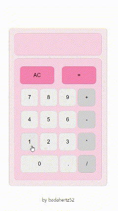

# 30projects_calculator

[페이지 바로 가기](https://badahertz52.github.io/30projects_calculator/)

### Index

#### <a href="#skill">1.테크 스킬 </a>

#### <a href="#introduce">2. 프로젝트 소개 </a>

---

## 
1.테크 스킬 

- html
- css
- js

## 
2. 프로젝트 소개 

#### 📷 프로젝트 작동 화면

 
1+1 처럼 하나의 연산 기호에 대한 계산에서 그치는 것이 아니라 여러 개의 연산에 대해 계산할 수 있는 계산기를 만들고 싶었다.

해당 프로젝트에서 사용가능한 계산 기능은 아래와 같다.

- 🔩계산기 기능

  - 힌번의 계산에 여러 개의 연산을 활용한 계산 가능
  - 지원하는 연산은 더하기,빼기, 나누기
  - 소수점을 사용하는 숫자 계산이 가능
  - "."을 눌렀을 때 화면에 입력한 숫자가 없는 경우 자동으로 "0."으로 표시됨
  - 최대 36자리의 계산식을 입력할 수 있고, 자리수를 초과할 경우 관련 메세지가 화면에 표시됨
  - "AC" 버튼을 통해 입력한 숫자나 연산기호를 계산식에서 삭제할 수 있음
